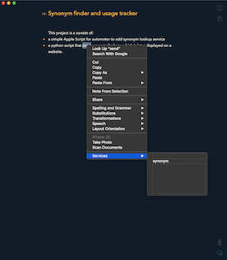
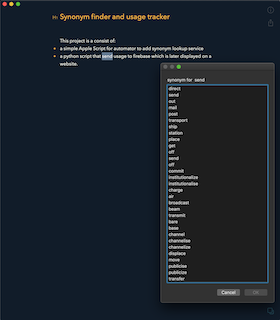
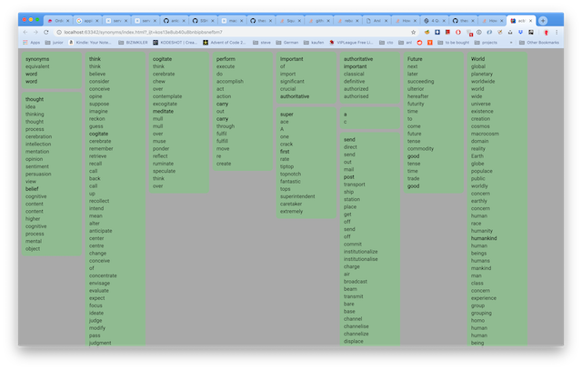

# Synonym finder and usage tracker

This project is a consist of:
- a simple Apple Script for automator to add synonym lookup service

     

- a python script that send usage to firebase which is later displayed on a website

   
